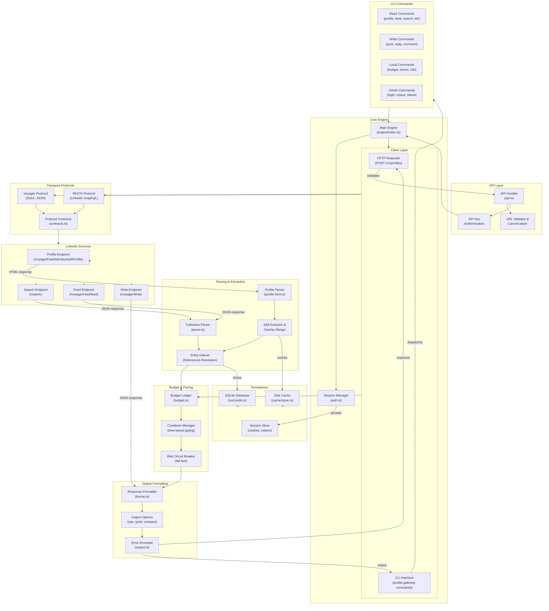

# Profile Gateway - LinkedIn Profile Extraction API

**Profile Gateway** is a production-grade, authenticated HTTP API that extracts LinkedIn profiles and returns structured JSON data. It transforms LinkedIn's web interface into a reliable, rate-limited, paced API with stable output schemas and comprehensive budget management.

## 🎯 Overview

Profile Gateway is designed as a complete solution for LinkedIn data extraction without requiring browser instances in the request path or expensive third-party scraping services. It works by:

1. **Authenticated Requests**: Uses session cookies (li_at, JSESSIONID) captured from a logged-in browser
2. **Server-Rendered Content**: Extracts data from LinkedIn's server-rendered HTML and SDUI components
3. **Paced Requests**: Implements intelligent rate limiting with budget tracking and cooldown management
4. **Stable Schema**: Provides consistent JSON output regardless of field availability
5. **Dual Interface**: HTTP API for production deployments + CLI for testing and research

### Key Capabilities

| Feature | Description |
|---------|-------------|
| **Profile Extraction** | Name, headline, location, about, experience, education, skills, certifications, languages, profile images |
| **Collections API** | Feed, search (people/companies/jobs), connections, post comments, reactions |
| **Write Operations** | Post creation, replies, comments, reactions (via Voyager protocol) |
| **Budget Management** | Per-class spending limits with automatic cooldowns and circuit breakers |
| **Authentication** | Production API-key authentication with session validation |
| **Deployment** | Docker support + Render.com configuration included |

---

## 📐 System Architecture

### Architecture Diagram



---

## 🏗️ Project Structure & Module Responsibilities

### Root Configuration

```
linkedin-main/
├── biome.json              # Code quality & formatting rules
├── tsconfig.json           # TypeScript compiler configuration
├── tsup.config.ts          # Build bundler configuration
├── package.json            # Dependencies & scripts
├── Dockerfile              # Container build specification
├── render.yaml             # Render.com deployment config
└── README.md               # This file
```

### Source Code Organization

#### **`src/`** - Main Application

**Core Entry Points:**
- **`server.ts`** - HTTP server with API endpoint handling
  - Loads session from environment variables
  - Creates engine instance
  - Implements profile queue (serialized access)
  - Returns standard JSON responses with API key validation

- **`cli.ts`** - Command-line interface dispatcher
  - Parses CLI arguments
  - Dispatches to appropriate command handler
  - Formats output (raw, quiet, compact, field-filtered)
  - Handles both read and write operations

- **`entry.ts`** - Entry point resolver
  - Determines whether to run as CLI or server
  - Environment-based routing

**API & HTTP Layer:**
- **`api.ts`** - HTTP request handler and response formatting
  - Parses LinkedIn profile URLs
  - Validates and canonicalizes URLs
  - Implements health check endpoint
  - Handles API key authentication
  - Returns properly formatted JSON envelopes

- **`types.ts`** - Shared TypeScript interfaces
  - `Ok<T>` / `Err` envelope types
  - `FetchState` (complete/partial/unknown)
  - `BudgetMeta` budget tracking
  - Response contracts

- **`output.ts`** - Error handling and response formatting
  - Standardized error codes and messages
  - Exit codes for CLI
  - Retry guidance and hints
  - JSON envelope formatting

**Argument Parsing & Configuration:**
- **`args.ts`** - Command-line argument parser
  - Type-safe argument parsing helpers
  - String, number, boolean extractors
  - Positional and flag handling

- **`format.ts`** - Data transformation & shaping
  - Converts internal entities to output format
  - Field filtering and selection
  - Output option application (raw, compact, etc.)

- **`profile.ts`** - Profile document construction
  - Shapes experience and education entries
  - Merges profile data with supplements
  - Constructs final ProfileDocument

- **`progress.ts`** - Progress reporting
  - CLI progress indicators
  - Status messages

#### **`src/engine/`** - Core Data Extraction Engine

The engine is the heart of the system - it orchestrates all LinkedIn API interactions.

- **`index.ts`** - Engine interface & factory
  - Engine interface definition (whoami, profile, feed, search, post, etc.)
  - Creates engine instances with dependencies
  - Coordinates between HTTP client and parsers
  - Manages result aggregation

- **`auth.ts`** - Session management
  - Session type definition (li_at, JSESSIONID, userAgent)
  - Session validation and freshness checking
  - Token refresh logic

- **`client.ts`** - HTTP client for LinkedIn
  - Network request handling
  - Cookie injection
  - User-Agent management
  - Protocol selection (Voyager vs RESTli)
  - Retry logic and error handling

- **`contracts.ts`** - Protocol contract definitions
  - Voyager SDUI contracts
  - RESTli GraphQL contracts
  - Entity collection contracts
  - Response envelope specifications

- **`parse.ts`** - Collection & entity parsing
  - Parses JSON responses from LinkedIn
  - Extracts entities from collections
  - Builds entity index (Map<string, Entity>)
  - Handles partial and unknown states
  - Cursor handling for pagination

- **`profile-html.ts`** - HTML parsing for profile pages
  - Parses server-rendered HTML
  - Extracts skill overlays
  - Merges skill associations from experience
  - Parses profile supplements (images, additional fields)
  - Uses Cheerio for DOM traversal

- **`restli.ts`** - RESTli protocol utilities
  - Encodes URN variables
  - Canonicalizes URNs
  - Builds RESTli API endpoints
  - Handles LinkedIn's encoded variable syntax

- **`budget.ts`** - Rate limiting & pacing
  - Budget ledger: tracks spending per rate-class
  - Cooldown manager: enforces time-based delays
  - Cap provenance: tracks origin of rate limits
  - Emits warnings when approaching limits
  - Circuit breaker logic

- **`session.ts`** - Session credentials handling
  - Session validation
  - Cookie format normalization

- **`classify.ts`** - Request cost classification
  - Classifies requests by cost/rate-class
  - Determines applicable budget caps
  - Calculates remaining budget

**Write Operations (SDUI & Voyager):**
- **`sdui-write.ts`** - SDUI protocol for creating content
  - Share/post creation via SDUI
  - SDUI action encoding

- **`sdui-comment.ts`** - Comment operations
  - Comment parsing from SDUI responses
  - Comment creation protocol

- **`sdui-reply.ts`** - Reply operations
  - Reply handling via SDUI

- **`sdui-harvest.ts`** - SDUI response harvesting
  - Extracts data from SDUI component updates
  - Merges nested response data

- **`sdui-menu.ts`** - SDUI menu handling
  - Parses SDUI action menus
  - Handles reaction options

- **`voyager-write.ts`** - Voyager protocol writes
  - Post creation via Voyager
  - Legacy write operations

- **`oauth-write.ts`** - OAuth-based write operations
  - Handles OAuth token-based writes

- **`oauth.ts`** - OAuth 2.0 flow
  - Authorization code flow
  - Token exchange and refresh
  - PKCE support

#### **`src/cache/`** - Persistence Layer

- **`store.ts`** - File-based cache
  - Directory management
  - JSON serialization/deserialization
  - Atomic writes

- **`db.ts`** - SQLite database
  - Structured data storage
  - Query interface

#### **`src/commands/`** - CLI Commands Implementation

**Meta/Local Commands:**
- **`local.ts`** - `doctor`, `budget`, `risk` commands
  - System diagnostics
  - Budget visualization
  - Risk assessment

- **`cache.ts`** - Cache management
  - `cache-status`, `purge`, `source-read` commands

**Session Commands:**
- **`oauth.ts`** - OAuth flow commands
  - `oauth login`, `oauth logout`, `oauth status`

**Read Commands:**
- **`live.ts`** - Main read operations
  - `whoami` - Current user info
  - `profile` - Profile extraction
  - `feed` - Home feed
  - `search` - People, companies, jobs search
  - `post` - Post comments and reactions
  - `reactions` - Who reacted to a post

**Write Commands:**
- **`write.ts`** - Content creation
  - `post` - Create new posts
  - `share` - Share content
  - `reply` - Reply to posts
  - `comment` - Comment on posts
  - `react` - Add reactions

**Utilities:**
- **`registry.ts`** - Command registry
  - Central command definitions
  - Metadata (cost, risk class, summary)
  - Command routing

- **`confirm.ts`** - User confirmation dialogs
- **`gate.ts`** - Permission/access gating
- **`transport.ts`** - Transport selection logic
- **`delete.ts`** - Deletion operations
- **`sync.ts`** - Sync operations
- **`token.ts`** - Token management

#### **`tests/`** - Comprehensive Test Suite

Unit and integration tests for all modules:
- API tests (`api.test.ts`)
- Engine tests (`budget.test.ts`, `classify.test.ts`, `client.test.ts`)
- Parser tests (`parse.test.ts`, `profile-html.test.ts`)
- Protocol tests (`restli.test.ts`, `sdui-*.test.ts`, `voyager-write.test.ts`)
- CLI tests (`cli.test.ts`, `oauth-login.test.ts`)
- Command tests (`delete.test.ts`, `sync.test.ts`, `write.test.ts`)

#### **`src/generated/`** - Generated Code

Auto-generated TypeScript from LinkedIn protocol definitions.

---

## 🔄 Data Flow

### Profile Extraction Flow

```
HTTP Request
    ↓
API Handler validates URL
    ↓
Auth: Check API key
    ↓
Engine.fullProfile(memberId, publicId)
    ↓
Client: Fetch profile HTML via Voyager
    ↓
ProfileParser: Extract main fields (HTML parsing)
    ↓
Client: Fetch sections (experience, education, skills)
    ↓
CollectionParser: Parse SDUI collections
    ↓
SkillExtractor: Merge skills from overlays
    ↓
EntityIndexer: Build entity map
    ↓
BudgetLedger: Check/deduct cost
    ↓
Format: Shape ProfileDocument
    ↓
Output: JSON response
    ↓
HTTP Response
```

### Collection Query Flow

```
CLI/HTTP: search(kind, query, limit)
    ↓
Engine.search()
    ↓
Client: Fetch search results via RESTli
    ↓
CollectionParser: Parse result entities
    ↓
EntityIndexer: Build entity map & resolve references
    ↓
BudgetLedger: Deduct cost, check cooldown
    ↓
Format: Apply output options (fields, raw, compact)
    ↓
Output: Formatted response
    ↓
CLI/HTTP Response
```

---

## ⚙️ Key Design Patterns

### 1. **Budget System**
- **Ledger-based**: Tracks spending per request class
- **Time-windowed**: Different classes have different windows (e.g., 1 request/second vs 100/day)
- **Multi-source caps**: Guessed, vendor lore, or measured from responses
- **Cooldown enforcement**: Automatic delays when approaching limits
- **Circuit breaker**: Hard stop when limits exceeded

### 2. **Entity Indexing**
LinkedIn returns many fields as URN references. The indexing system:
- Collects entities into a `Map<string, Entity>`
- Allows O(1) resolution of references
- Enables circular relationships (education → school URN → school entity)
- Handles partial availability gracefully

### 3. **FetchState Semantics**
Three-valued logic for collection completeness:
- `complete` - Full collection retrieved
- `partial` - Limit reached, more data may exist
- `unknown` - Reached cursor limit, cannot determine exhaustion

**Never uses optional boolean** - ambiguous missing values default to "ok" which is a classic bug pattern.

### 4. **Queue Serialization**
- HTTP API serializes concurrent requests to shared pacing ledger
- Prevents concurrent traffic from defeating rate limits
- Queue is per-server instance
- Uses Promise chains for ordering

### 5. **Session Immutability**
- Session credentials loaded once at startup
- Captured from Chrome DevTools Protocol
- No automatic refresh (manual reauth required)
- Enables stateless deployment

### 6. **Envelope Responses**
All responses wrapped in consistent envelope:
```typescript
{
  ok: true | false,
  command: string,
  data?: T,
  error?: {
    code: string,
    message: string,
    hint?: string,
    status?: number,
    retryAfterMs?: number
  }
}
```

---

## 🛡️ Security Architecture

### Authentication

| Layer | Mechanism | Purpose |
|-------|-----------|---------|
| **Session** | LinkedIn li_at + JSESSIONID | Browser authentication (captured once) |
| **API** | Bearer token (API key) | HTTP request authentication |
| **OAuth** | Authorization code flow (PKCE) | Delegated write operations |

### Credential Storage

- **Never committed**: .env ignored in version control
- **Owner-only permissions**: Cache directory chmod 700
- **No logging**: Credentials stripped from debug logs
- **Single-use keys**: Rotation recommended

### Rate Limiting

- **Proactive**: Maintains pacing before hitting LinkedIn's limits
- **No retry**: Fails fast when limits exceeded
- **Transparent**: Budget available in every response
- **Advisory**: Warns when approaching caps

---

## 📦 Features Breakdown

### Core Extraction

| Feature | Status | Cost | Notes |
|---------|--------|------|-------|
| Profile (basic) | ✅ Live | 1 call | Name, headline, location, about |
| Experience | ✅ Live | +1 per section | Merged from HTML + overlays |
| Education | ✅ Live | +1 per section | Degree, school, dates |
| Skills | ✅ Live | +1 per section | Deduplicated from all overlays |
| Certifications | ✅ Live | +1 per section | Issuer, dates, credentials |
| Languages | ✅ Live | +1 per section | With proficiency levels |
| Images | ✅ Live | +1 section | Profile + background |

### Collections

| Feature | Status | Cost | Limit | Notes |
|---------|--------|------|-------|-------|
| Feed | ✅ Live | 1 + pagination | 50/window | Home timeline |
| Search (people) | ✅ Live | 1 + pagination | 100/day | By query |
| Search (companies) | ✅ Live | 1 + pagination | 100/day | By query |
| Search (jobs) | ✅ Live | 1 + pagination | 100/day | By query |
| Connections | ✅ Live | 1 + pagination | 500/month | Your network |
| Post comments | ✅ Live | 1 + pagination | 50/window | Thread replies |
| Reactions | ✅ Live | 1 + pagination | 50/window | Who reacted |

### Write Operations

| Feature | Status | Cost | Transport | Gating |
|---------|--------|------|-----------|--------|
| Create post | ✅ Live | 10 | Voyager | Manual confirm |
| Reply to post | ✅ Live | 10 | Voyager | Manual confirm |
| Comment on post | ✅ Live | 10 | Voyager | Manual confirm |
| React to post | ✅ Live | 5 | SDUI menu | Manual confirm |
| Share post | ✅ Live | 10 | Voyager | Manual confirm |

---

## 🚀 Features & Capabilities

### Core API

- ✅ **`POST /v1/profiles`** - Extract profile from URL
- ✅ **`GET /health`** - Deployment health check
- ✅ Strict LinkedIn profile URL validation
- ✅ Automatic self-profile resolution (`{}` payload)
- ✅ All rendered experience cards and education entries
- ✅ Skills merged and deduplicated across all overlays
- ✅ Stable response schema with empty arrays for unavailable data
- ✅ Production API-key authentication
- ✅ Conservative pacing with budget limits and cooldowns
- ✅ Zero automatic retries (fail-fast on rate limits)

### Deployment

- ✅ Docker containerization
- ✅ Render.com deployment configuration
- ✅ Environment variable configuration
- ✅ Health check monitoring
- ✅ Graceful error handling

### CLI Tool

- ✅ Session management (login, logout, status)
- ✅ Profile extraction
- ✅ Feed, search, connections browsing
- ✅ Budget and cooldown monitoring
- ✅ System diagnostics (doctor command)
- ✅ Write operations (post, reply, comment, react)
- ✅ Multiple output formats (raw, quiet, compact, field filtering)

---

## 📋 Requirements

| Requirement | Version | Purpose |
|-------------|---------|---------|
| **Bun** | ≥1.1.0 | Runtime & package manager |
| **TypeScript** | ≥7.0.0 | Language |
| **Node.js compatible** | ≥18.0 | For deploy environments |
| **LinkedIn Account** | Active | Session capture |
| **Chrome/Edge** | Recent | Remote debugging |

---

## 🔧 Local Development Setup

### Prerequisites

1. Install [Bun](https://bun.sh/):
```powershell
powershell -c "irm bun.sh/install.ps1 | iex"
```

2. Clone the repository:
```powershell
git clone <repo-url>
cd linkedin-main
```

### Installation

```powershell
# Install dependencies
bun install

# Copy environment template
Copy-Item .env.example .env
```

### Session Capture

Start Microsoft Edge with remote debugging:

```powershell
$profileDir = "$env:LOCALAPPDATA\ProfileGateway\Chrome"
Start-Process "C:\Program Files (x86)\Microsoft\Edge\Application\msedge.exe" `
  -ArgumentList @(
    "--remote-debugging-port=9222",
    "--user-data-dir=$profileDir",
    "https://www.linkedin.com/feed/"
  )
```

Log into LinkedIn in that window, then capture the session:

```powershell
# Capture cookies and session
bun run dev -- login

# Verify the session works
bun run dev -- whoami
```

### Configuration

Copy the captured values from terminal output into `.env`:

```env
LINKEDIN_LI_AT=your_li_at_cookie
LINKEDIN_JSESSIONID=your_jsessionid_cookie
LINKEDIN_USER_AGENT=Mozilla/5.0...
LINKEDIN_SESSION_CAPTURED_AT=2026-08-31T10:00:00.000Z
API_KEY=your_generated_api_key
```

### Generate API Key

```powershell
# Generate 32-byte random hex string
$bytes = New-Object byte[] 32
[Security.Cryptography.RandomNumberGenerator]::Fill($bytes)
$apiKey = [Convert]::ToHexString($bytes).ToLowerInvariant()
Write-Host "API Key: $apiKey"
```

Add to `.env`:
```env
API_KEY=your_generated_api_key
```

### Running the Server

```powershell
# Development server (with auto-reload)
bun run dev:api

# Test the health endpoint
Invoke-RestMethod "http://127.0.0.1:3000/health"

# Expected response:
# { "status": "ok" }
```

---

## 📡 API Documentation

### Base URL
```
http://127.0.0.1:3000 (development)
https://api.example.com (production)
```

### Authentication

All requests (except `/health`) require:
```http
Authorization: Bearer <API_KEY>
```

### Health Check

**Endpoint**: `GET /health`

**No authentication required**

**Response** (200 OK):
```json
{
  "status": "ok"
}
```

---

### Extract Profile

**Endpoint**: `POST /v1/profiles`

**Headers**:
```http
Authorization: Bearer <API_KEY>
Content-Type: application/json
```

**Request** - By URL:
```json
{
  "url": "https://www.linkedin.com/in/example-profile/"
}
```

**Request** - Self Profile:
```json
{}
```

**Response** (200 OK):
```json
{
  "profileUrl": "https://www.linkedin.com/in/example-profile/",
  "publicIdentifier": "example-profile",
  "name": "Example Person",
  "headline": "Software Engineer at Tech Company",
  "location": "San Francisco, CA",
  "about": "Passionate about...",
  "experience": [
    {
      "title": "Senior Engineer",
      "company": "Tech Company",
      "location": "San Francisco, CA",
      "description": "Led team of...",
      "startDate": { "month": 3, "year": 2020 },
      "endDate": null
    }
  ],
  "education": [
    {
      "school": "State University",
      "degree": "Bachelor of Science",
      "fieldOfStudy": "Computer Science",
      "description": "GPA: 3.8",
      "startDate": { "year": 2016 },
      "endDate": { "year": 2020 }
    }
  ],
  "skills": [
    { "name": "TypeScript" },
    { "name": "React" },
    { "name": "Node.js" }
  ],
  "certifications": [
    {
      "name": "AWS Certified Solutions Architect",
      "issuer": "Amazon Web Services",
      "credentialId": "12345-67890",
      "credentialUrl": "https://...",
      "issuedAt": { "month": 6, "year": 2023 },
      "expiresAt": null
    }
  ],
  "languages": [
    { "name": "English", "proficiency": "Native" },
    { "name": "Spanish", "proficiency": "Intermediate" }
  ],
  "images": {
    "profile": "https://media.licdn.com/...",
    "background": "https://media.licdn.com/..."
  }
}
```

**Errors**:

| Code | Status | Cause |
|------|--------|-------|
| `INVALID_URL` | 400 | URL format invalid |
| `INVALID_PROFILE` | 400 | Not a LinkedIn /in/ profile |
| `UNAUTHORIZED` | 401 | Missing/invalid API key |
| `NOT_FOUND` | 404 | Profile doesn't exist or not accessible |
| `RATE_LIMITED` | 429 | Budget exhausted, retry after time |
| `SERVER_ERROR` | 500 | Internal error |

**Example Error Response** (429):
```json
{
  "ok": false,
  "code": "RATE_LIMITED",
  "message": "API budget exhausted for this window",
  "hint": "Reset cooldown with: profile-gateway budget --reset-cooldown --confirm",
  "status": 429,
  "retryAfterMs": 3600000
}
```

---

## 🖥️ CLI Usage

### Command Structure

```
profile-gateway <command> [options] [flags]
```

### Meta Commands (Local, No Network)

#### `doctor` - System Diagnostics

```powershell
# Check setup and configuration
bun run dev -- doctor

# Offline check (no network access)
bun run dev -- doctor --offline
```

Output includes:
- Entry point detection
- Cache directory status
- Cookie freshness
- Cooldown state
- Budget summary

#### `budget` - Budget Management

```powershell
# Display current spending ledger
bun run dev -- budget

# Reset a cooldown period
bun run dev -- budget --reset-cooldown --confirm
```

Output:
```
Budget Status:
  PROFILE: 10/unlimited, window: 1000ms, provenance: guessed
  FEED: 5/50, window: 1h, provenance: measured
  SEARCH: 20/100, window: 1d, provenance: vendor-lore
  
Warnings:
  FEED approaching limit (10% remaining)
```

#### `risk` - Risk Assessment

```powershell
# Check circuit breaker state
bun run dev -- risk
```

Output:
```
Risk: OK
Failsafe: Off
Recent errors: 0
```

---

### Session Commands

#### `login` - Capture Session from Browser

```powershell
# Start Edge with remote debugging, then:
bun run dev -- login
```

Outputs:
```
Connecting to Chrome via DevTools...
Session captured: li_at=ABC..., JSESSIONID=XYZ...
Copy these to .env
```

#### `whoami` - Current User

```powershell
bun run dev -- whoami
```

Output:
```json
{
  "name": "Your Name",
  "headline": "Your headline",
  "urn": "urn:li:member:12345678"
}
```

---

### Read Commands

#### `profile` - Extract Profile

```powershell
# By URL
bun run dev -- profile --url "https://www.linkedin.com/in/example/"

# Self profile
bun run dev -- profile

# Output as raw JSON
bun run dev -- profile --url "..." --raw

# Select specific fields
bun run dev -- profile --url "..." --fields "name,headline,experience"

# Compact output (single line)
bun run dev -- profile --url "..." --compact
```

#### `feed` - Home Timeline

```powershell
# Get home feed
bun run dev -- feed --limit 10

# Quiet mode (only IDs)
bun run dev -- feed --quiet

# Save for later processing
bun run dev -- feed --limit 50 --raw > feed.json
```

#### `search` - Find People, Companies, Jobs

```powershell
# Search for people
bun run dev -- search --kind people --query "software engineer" --limit 25

# Search companies
bun run dev -- search --kind companies --query "apple"

# Search jobs
bun run dev -- search --kind jobs --query "data scientist"
```

#### `connections` - Your Network

```powershell
bun run dev -- connections --limit 100
```

---

### Write Commands

#### `post` - Create a Post

```powershell
# Create a text post
bun run dev -- post --text "Just released v3.0! 🚀" --via voyager

# Requires manual confirmation
# Shows content preview before posting
# Only '--via voyager' supported (OAuth in progress)
```

#### `reply` - Reply to Post

```powershell
# Reply to a post (URN required)
bun run dev -- reply --post-urn "urn:li:activity:7000000000000000000" `
  --text "Great post!" --via voyager
```

#### `comment` - Comment on Post

```powershell
bun run dev -- comment --post-urn "urn:li:activity:7000000000000000000" `
  --text "This is helpful" --via voyager
```

#### `react` - Add Reaction

```powershell
# React to a post
bun run dev -- react --post-urn "urn:li:activity:7000000000000000000" `
  --emoji "like" --via voyager
```

---

### Output Options

All read commands support output formatting:

| Option | Effect |
|--------|--------|
| `--raw` | Unmodified JSON (no envelope) |
| `--quiet` | IDs only |
| `--compact` | Single-line output |
| `--retain` | Don't page output |
| `--fields "name,headline"` | Select columns |

---

## 🐳 Docker Deployment

### Build Image

```bash
docker build -t linkedin-gateway:latest .
```

### Run Container

```bash
docker run -d \
  --name linkedin-gateway \
  -p 3000:3000 \
  -e LINKEDIN_LI_AT="..." \
  -e LINKEDIN_JSESSIONID="..." \
  -e LINKEDIN_USER_AGENT="..." \
  -e API_KEY="..." \
  linkedin-gateway:latest
```

### Environment Variables

```env
# Required
LINKEDIN_LI_AT=<cookie_value>
LINKEDIN_JSESSIONID=<cookie_value>
LINKEDIN_USER_AGENT=<user_agent_string>
API_KEY=<api_key>

# Optional
LINKEDIN_SESSION_CAPTURED_AT=<iso_timestamp>
PORT=3000 (default)
LOG_LEVEL=info (debug|info|warn|error)
CORS_ORIGIN=* (CORS allowlist)
```

---

## ☁️ Render.com Deployment

Configuration is provided in `render.yaml`:

```yaml
services:
  - type: web
    name: profile-gateway
    runtime: docker
    region: oregon
    plan: starter
    healthCheckPath: /health
    env:
      - key: LINKEDIN_LI_AT
        sync: false
      - key: LINKEDIN_JSESSIONID
        sync: false
      - key: LINKEDIN_USER_AGENT
        sync: false
      - key: API_KEY
        sync: false
```

Deploy:
```bash
render deploy --config render.yaml
```

---

## 🧪 Testing

### Run All Tests

```powershell
bun test
```

### Run Specific Test File

```powershell
bun test tests/profile.test.ts
```

### Watch Mode

```powershell
bun test --watch
```

### Test Coverage

Tests cover:
- API endpoint validation
- Profile parsing and extraction
- Budget ledger operations
- Entity indexing and references
- CLI command dispatch
- Error handling and recovery
- OAuth flow
- Write operations

---

## 🛠️ Development Commands

| Command | Purpose |
|---------|---------|
| `bun run dev` | Run CLI tool |
| `bun run dev:api` | Start HTTP server |
| `bun run build` | Build for production (tsup) |
| `bun run typecheck` | Type check only |
| `bun run lint` | Check code quality |
| `bun run lint:fix` | Auto-fix linting issues |
| `bun run format` | Format code (Biome) |
| `bun run test` | Run test suite |
| `bun run check` | typecheck + lint + test |

---

## 🏛️ Production Checklist

Before deploying to production:

- [ ] Generate strong API key (32+ bytes)
- [ ] Set all required environment variables
- [ ] Test health endpoint works
- [ ] Verify session is recent (< 7 days old)
- [ ] Monitor budget alerts
- [ ] Enable logging
- [ ] Set up monitoring/alerting
- [ ] Use HTTPS only (never HTTP)
- [ ] Implement API rate limiting (per-consumer)
- [ ] Rotate session credentials monthly
- [ ] Document API SLA expectations
- [ ] Plan for session re-authentication

---

## 🔐 Security Considerations

### Session Security
- Captured once from browser, never refreshed
- Stored in `.env` (never committed)
- Owner-only file permissions
- Consider session rotation policy (monthly recommended)

### API Key Management
- Generate with cryptographically-secure RNG
- Rotate regularly (every 90 days)
- Use different keys per environment
- Never log or expose in errors
- Implement rate limiting per key

### Request Pacing
- Intentionally slow to avoid detection
- No automatic retries (fail-fast)
- Conservative budget caps
- Transparent cost reporting

### Data Privacy
- Does not cache profile contents
- Cache only metadata (dates, URLs)
- Fully respects LinkedIn's robots.txt
- User-agent accurately identifies requests

---

## 📊 Monitoring & Observability

### Metrics to Track

1. **Budget Metrics**
   - Current spending per class
   - Cooldown state
   - Time until reset

2. **Performance**
   - Request latency
   - Queue depth
   - Cache hit rate

3. **Reliability**
   - Error rate (by code)
   - Session freshness
   - Uptime %

4. **Compliance**
   - Pacing adherence
   - Rate limit violations
   - Budget exhaustion events

### Logging

Set `LOG_LEVEL` environment variable:
```env
LOG_LEVEL=debug  # Verbose request/response
LOG_LEVEL=info   # Normal operations
LOG_LEVEL=warn   # Budget warnings
LOG_LEVEL=error  # Errors only
```

---

## 🚨 Troubleshooting

### Common Issues

| Problem | Solution |
|---------|----------|
| `INVALID_URL` errors | Ensure URL is in format `https://www.linkedin.com/in/<profile>/` |
| `NOT_FOUND` | Profile doesn't exist or not visible to your session |
| `RATE_LIMITED` | Wait for cooldown or run `profile-gateway budget --reset-cooldown --confirm` |
| `UNAUTHORIZED` | Check `.env` - cookies may be stale, recapture with `login` |
| Session expired | LinkedIn sessions last ~7 days; recapture with `bun run dev -- login` |
| Blank fields in response | Field not visible to authenticated session; not an API limitation |

### Debug Commands

```powershell
# System diagnostics
bun run dev -- doctor --offline

# Check budget state
bun run dev -- budget

# Verify session
bun run dev -- whoami

# Test single profile (with verbose output)
bun run dev -- profile --url "..." --raw
```

---

##  Additional Resources

- [LinkedIn terms of service](https://www.linkedin.com/legal/user-agreement)
- [Bun documentation](https://bun.sh/docs)
- [TypeScript handbook](https://www.typescriptlang.org/docs)
- [Render deployment docs](https://render.com/docs)

PowerShell example:

```powershell
$headers = @{
  Authorization = "Bearer YOUR_API_KEY"
  "Content-Type" = "application/json"
}
$body = @{ url = "https://www.linkedin.com/in/example-profile/" } | ConvertTo-Json

$response = Invoke-RestMethod `
  -Method Post `
  -Uri "http://127.0.0.1:3000/v1/profiles" `
  -Headers $headers `
  -Body $body

$response | ConvertTo-Json -Depth 20
```

Example response:

```json
{
  "data": {
    "profileUrl": "https://www.linkedin.com/in/example-profile/",
    "publicIdentifier": "example-profile",
    "name": "Alex Example",
    "headline": "Platform Engineer",
    "location": "Example City, Example Region",
    "about": "Profile summary when available",
    "experience": [
      {
        "title": "Software Engineer",
        "company": "Example Labs",
        "location": "Example City",
        "startDate": { "month": 1, "year": 2024 }
      }
    ],
    "education": [
      {
        "school": "Example University",
        "degree": "BTech",
        "fieldOfStudy": "Computer Science"
      }
    ],
    "skills": [
      { "name": "TypeScript" },
      { "name": "Distributed Systems" }
    ],
    "certifications": [
      { "name": "Example Certification", "issuer": "Example Institute" }
    ],
    "languages": [
      { "name": "English", "proficiency": "NATIVE_OR_BILINGUAL" }
    ],
    "images": {
      "profile": "https://media.licdn.com/example-profile-image"
    }
  }
}
```

Optional scalar properties are omitted when unavailable. Collection properties are always arrays,
and `images` is always an object.

### Errors

```json
{
  "error": {
    "code": "INVALID_INPUT",
    "message": "url must be an HTTPS LinkedIn profile URL"
  }
}
```

| Status | Meaning |
|---|---|
| `400` | Invalid JSON or profile URL |
| `401` | Missing or incorrect API key |
| `404` | Profile not found |
| `429` | Request budget exhausted or cooldown active |
| `502` | LinkedIn authentication, challenge, or upstream failure |

## Approach

The response combines several authenticated sources:

1. A decorated profile summary supplies headline, location, current position, and education
   references.
2. The server-rendered experience page supplies all visible experience cards.
3. Every experience skill-association overlay supplies its associated skill list; names are merged
   and deduplicated.
4. The rendered profile header supplies the display name and profile image.
5. Remaining certification and language collections supply those optional sections.

Every upstream call uses one classified client. It checks a persistent cooldown and request budget,
adds a conservative delay, performs exactly one request, and never retries automatically. API
requests are serialised so concurrent traffic cannot bypass pacing.

## Configuration

| Variable | Required | Purpose |
|---|---:|---|
| `LINKEDIN_LI_AT` | Yes | Authenticated LinkedIn session cookie |
| `LINKEDIN_JSESSIONID` | Yes | LinkedIn CSRF/session value |
| `LINKEDIN_USER_AGENT` | Yes | User agent from the browser that created the session |
| `API_KEY` | Production | Bearer token protecting the API |
| `LINKEDIN_SESSION_CAPTURED_AT` | No | Session-age diagnostic timestamp |
| `PORT` | No | HTTP port; defaults to `3000` |
| `CORS_ORIGIN` | No | Allowed browser origin |
| `PROFILE_GATEWAY_CACHE_DIR` | No | Budget, cooldown, and session directory |

## Testing

```powershell
bun run typecheck
bun run lint
bun test tests/api.test.ts tests/profile.test.ts tests/profile-html.test.ts
bun run build
```

Parser and API tests use synthetic fixtures and never contact LinkedIn. Live verification must use
the operator's own account and should be performed conservatively.

## Deployment on Render

1. Push this repository to GitHub.
2. Create a Render Blueprint and select the repository.
3. Render reads `render.yaml` and builds the included `Dockerfile`.
4. Add `LINKEDIN_LI_AT`, `LINKEDIN_JSESSIONID`, `LINKEDIN_USER_AGENT`, and
   `LINKEDIN_SESSION_CAPTURED_AT` as secret environment variables.
5. Render generates `API_KEY`; copy it for API clients.
6. Verify `https://<service-host>/health`, then call `POST /v1/profiles` over HTTPS.

Never put production credentials in `render.yaml`, Docker layers, source files, GitHub Actions, or
commits.

## Optional Voyager posting

Voyager posting is an additional CLI feature and is not exposed through the HTTP API. It requires
an interactive confirmation:

```powershell
bun run dev -- share "Your post text" --via voyager
```

The command shows the exact text, visibility, transport, and confirmation token before sending. Its
automated tests mock the network and never publish a real post.

## Known limitations and risk

- LinkedIn does not provide a sanctioned individual-developer API for arbitrary profile reads. This
  implementation uses private web endpoints and may violate LinkedIn's User Agreement; the account
  can be challenged, restricted, or banned.
- LinkedIn can change query IDs, HTML, SDUI payloads, and response shapes without notice.
- Sessions expire and may require a fresh browser login.
- Privacy settings determine which fields the backend account can access.
- Skills are collected from rendered experience associations. Unrendered or unassociated skills may
  not be returned.
- LinkedIn may legitimately return no languages, certifications, background image, or about section.
- A complete extraction intentionally takes time because every upstream call is paced.
- The service is single-account by design and is not intended for bulk harvesting.

## Security

- `.env`, cookies, HAR files, and captures are excluded by `.gitignore`.
- Production refuses to start without `API_KEY`.
- Responses never include cookies, CSRF values, raw LinkedIn payloads, or internal hints.
- Redirects are classified instead of silently following login or checkpoint pages.


